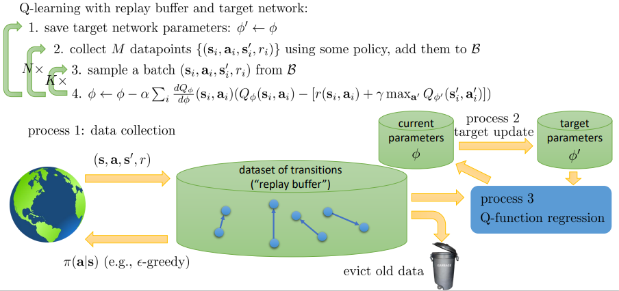

# 强化学习笔记

## 1 Policy Gradient

## 2 Actor-Critic

## 3 Q-Learning

Q-Learning和Actor-Critic不同的地方在于它完全忽略了策略，因为如果拟合Q函数是正确的，那么就可以通过Q函数就可以直接采用贪心法推出策略：
$$
\pi^{\prime}\left(\mathbf{a}_{t} \mid \mathbf{s}_{t}\right)=\left\{\begin{array}{l}
1 \text { if } \mathbf{a}_{t}=\arg \max _{\mathbf{a}_{t}} A^{\pi}\left(\mathbf{s}_{t}, \mathbf{a}_{t}\right) \\
0 \text { otherwise }
\end{array}\right.
$$

$$
A^{\pi}(\mathbf{s},\mathbf{a})=r(\mathbf{s},\mathbf{a})+\gamma E[V^{\pi}(\mathbf{s}^\prime)]-V^\pi(\mathbf{s})
$$

这样就不需要用神经网络来表示策略。为了求出优势函数，则需要拟合价值函数。

### 3.1 Dynamic Programminga

假设已知$p(s^\prime|\mathbf{s},\mathbf{a})$当s和a都是离散的情况下，可以用tabular方法表示出转换运算符，然后通过自举的方式更新价值函数。
$$
V^\pi(\mathbf{s})\leftarrow r(\mathbf{s},\pi(\mathbf{s}))+\gamma E_{\mathbf{s}^\prime\sim p(s^\prime|\mathbf{s},\pi(\mathbf{s}))}[V^\pi(\mathbf{s^\prime})]
$$
因为对于每一个a而言，优势函数的后两项都是一样的，所以这样更新策略
$$
\arg \max _{\mathbf{a}_{t}} A^{\pi}\left(\mathbf{s}_{t}, \mathbf{a}_{t}\right)=\arg \max _{\mathbf{a}_{t}} Q^{\pi}\left(\mathbf{s}_{t}, \mathbf{a}_{t}\right)
$$
如此迭代：
$$
Q^{\pi}(\mathbf{s},\mathbf{a})\leftarrow r(\mathbf{s},\mathbf{a})+\gamma E[V^{\pi}(\mathbf{s}^\prime)]
$$

$$
V(s)\leftarrow \max_a Q(\mathbf{s},\mathbf{a})
$$

这样就可以跳过直接计算价值函数和策略的步骤。

### 3.2 Fitted Value Iteration

当s和a空间很大的时候，如果使用向量表示$V(s)$就会造成维数灾难，这种情况下可以使用神经网络。

此时就转化成一个回归问题，如此迭代：
$$
\begin{array}{l}
\mathbf{y}_{i} \leftarrow \max _{\mathbf{a}_{i}}\left(r\left(\mathbf{s}_{i}, \mathbf{a}_{i}\right)+\gamma E\left[V_{\phi}\left(\mathbf{s}_{i}^{\prime}\right)\right]\right) \\
\phi \leftarrow \arg \min _{\phi} \frac{1}{2} \sum_{i}\left\|V_{\phi}\left(\mathbf{s}_{i}\right)-\mathbf{y}_{i}\right\|^{2}
\end{array}
$$
此处也忽略了policy，而是直接计算价值函数。

### 3.3 Transitions are unknown

如果没有具体的模型，那么就很难完成以下更新
$$
\mathbf{y}_{i} \leftarrow \max _{\mathbf{a}_{i}}\left(r\left(\mathbf{s}_{i}, \mathbf{a}_{i}\right)+\gamma E\left[V_{\phi}\left(\mathbf{s}_{i}^{\prime}\right)\right]\right)
$$
因为当维数很大或模型未知的时候，无法回到上一个状态，然后在模型中运行不同的action，获取对应的Q函数值。所以可以尝试不去学习价值函数而是Q函数：
$$
V^\pi(\mathbf{s})\leftarrow r(\mathbf{s},\pi(\mathbf{s}))+\gamma E_{\mathbf{s}^\prime\sim p(s^\prime|\mathbf{s},\pi(\mathbf{s}))}[V^\pi(\mathbf{s^\prime})]
$$

$$
Q^{\pi}(\mathbf{s}, \mathbf{a}) \leftarrow r(\mathbf{s}, \mathbf{a})+\gamma E_{\mathbf{s}^{\prime} \sim p\left(\mathbf{s}^{\prime} \mid \mathbf{s}, \mathbf{a}\right)}\left[Q^{\pi}\left(\mathbf{s}^{\prime}, \pi\left(\mathbf{s}^{\prime}\right)\right)\right]
$$

这样在通过argmax更新策略的时候，就可以不用在环境中执行不同的action，而只是通过Q函数计算action的reward。

对于fitted value iteration算法，可令：
$$
E\left[V\left(\mathbf{s}_{i}^{\prime}\right)\right] \approx \max _{\mathbf{a}^{\prime}} Q_{\phi}\left(\mathbf{s}_{i}^{\prime}, \mathbf{a}_{i}^{\prime}\right)
$$
对于该算法这样做的优点是：

1. works for off-policy
2. 只需要一个神经网络，policy gradient方差较低

缺点是无法保证对于非线性函数是收敛的。

### 3.4 Full Fitted Q-iteration

利用3.3的方法对Fitted Value Iteration改进后的算法就是Fitted Q-iteration

因为给出s和a后，transition和$\pi$无关，所以这是off-policy的算法。

对于tabular法表示的价值函数该算法是可以收敛的，但是对于神经网络表示的函数一般是无法收敛的。

算法的第二步旨在提升policy（tabular case），第三步减少了Q函数的误差。

### 3.5 Online Q-learning

这是Q-learning算法的基本原型，仅适用于tabular和线性的价值函数。

### 3.6 改进措施

#### 3.6.1 epsilon-greedy

$$
\pi\left(\mathbf{a}_{t} \mid \mathbf{s}_{t}\right)=\left\{\begin{array}{l}
1-\epsilon \text { if } \mathbf{a}_{t}=\arg \max _{\mathbf{a}_{t}} Q_{\phi}\left(\mathbf{s}_{t}, \mathbf{a}_{t}\right) \\
\epsilon /(|\mathcal{A}|-1) \text { otherwise }
\end{array}\right.
$$

#### 3.6.2 Boltzmann exploration

$$
\pi\left(\mathbf{a}_{t} \mid \mathbf{s}_{t}\right)=exp(Q_{\phi}(\mathbf{s}_{t}, \mathbf{a}_{t}))\cdot k
$$

#### 3.6.3 Parallelism

传统Q-learning算法的第一步是执行某个action然后观察$(\mathbf{s}_{i}, \mathbf{a}_{i},\mathbf{s}^{\prime}_{i}, r_i)$，但是前后两个状态是强相关的，同时目标值一直在改变，所以难以收敛。

所以可以采用并行化的方法，解决状态相关的问题。

#### 3.6.4 replay buffers

另一个解决方案是使用replay buffers，可以解决相关问题，同时使gradient方差变小。K通常取1

#### 3.6.5 Target Networks

$$
\phi \leftarrow \phi-\alpha \frac{d Q_{\phi}}{d \phi}\left(\mathbf{s}_{i}, \mathbf{a}_{i}\right)\left(Q_{\phi}\left(\mathbf{s}_{i}, \mathbf{a}_{i}\right)-\left[r\left(\mathbf{s}_{i}, \mathbf{a}_{i}\right)+\gamma \max _{\mathbf{a}^{\prime}} Q_{\phi}\left(\mathbf{s}_{i}^{\prime}, \mathbf{a}_{i}^{\prime}\right)\right]\right)
$$

在学习Q函数时，$\left[r\left(\mathbf{s}_{i}, \mathbf{a}_{i}\right)+\gamma \max _{\mathbf{a}^{\prime}} Q_{\phi}\left(\mathbf{s}_{i}^{\prime}, \mathbf{a}_{i}^{\prime}\right)\right]$这部分使用了参数$\phi$但是却并没有被计算进梯度中，所以这并不是一个梯度下降，所以无法保证收敛，该问题无法完全解决，但是可以被减轻。

在更新参数时，为了使目标值稳定，可以采用target networks：

#### 3.6.6 DQN

3.6.5中的K=1时，就是经典的DQN算法：

当然，不必每次都要经过N次才更新参数，可以和Polyak averaging一样更新参数：
$$
\phi^\prime:\leftarrow \tau \phi^\prime+(1-\tau)\phi
$$

#### 3.6.7 General view of Q-learning

| 算法               | 步骤频率      | 丢弃 |
| ------------------ | ------------- | ---- |
| Online Q-learning  | $p_1=p_2=p_3$ | 立刻 |
| DQN                | $p_1=p_3>p_2$ | ?    |
| Fitted Q-iteration | $p_1<p_2<p_3$ | ?    |

#### 3.6.8 Double DQN

在实践中Q函数值通常会大于实际的奖励值，原因是在更新$y_i$的时候：
$$
y_i=r_j+\gamma \max_{\mathbf{a}^\prime_j}Q_{\phi^\prime}(\mathbf{s}^\prime_j,\mathbf{a}^\prime_j)
$$
如果Q函数时不准确的，最后的max部分会高估奖励值，这让Q函数看起来像是有噪声的。原因如下：
$$
E[\max(X_1,X_2)]\geq\max(E[X_1],E[X_2])
$$
易证：
$$
\max _{\mathbf{a}^{\prime}} Q_{\phi^{\prime}}\left(\mathbf{s}^{\prime}, \mathbf{a}^{\prime}\right)=Q_{\phi^{\prime}}\left(\mathbf{s}^{\prime}, \arg \max _{\mathbf{a}^{\prime}} Q_{\phi^{\prime}}\left(\mathbf{s}^{\prime}, \mathbf{a}^{\prime}\right)\right)
$$
由于value和action选择都来自于同一个函数，所以，假设当Q函数对$a_1,a_2$的奖励估计错误时，$a_1,a_2$的实际奖励为(5.6, 7.8)，估计的奖励值为(8.4, 6.8)，那么Q函数就会选择一个实际上更低的action。

解决方法是让value计算和action选择都独立开来，在用于value计算的Q函数估计错误时，只要另一个用于action选择的Q函数没有估计错误，那么就可以避免选择错误的action。
$$
\begin{array}{l}
Q_{\phi_{A}}(\mathbf{s}, \mathbf{a}) \leftarrow r+\gamma Q_{\phi_{B}}\left(\mathbf{s}^{\prime}, \arg \max _{\mathbf{a}^{\prime}} Q_{\phi_{A}}\left(\mathbf{s}^{\prime}\right)\right) \\
Q_{\phi_{B}}(\mathbf{s}, \mathbf{a}) \leftarrow r+\gamma Q_{\phi_{A}}\left(\mathbf{s}^{\prime}, \arg \max _{\mathbf{a}^{\prime}} Q_{\phi_{B}}\left(\mathbf{s}^{\prime}\right)\right)
\end{array}
$$
在实践中，训练两个神经网络比较麻烦，所以通常采用target和current network作为两个Q函数。

